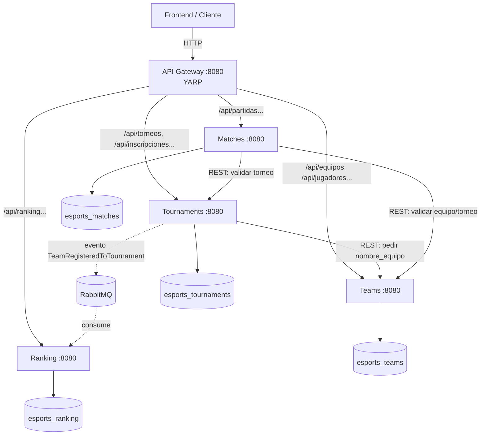

# 01 — Arquitectura

## Visión general

La plataforma es un sistema distribuido de microservicios. Cada servicio es dueño de su propio dominio y su propia base de datos (keyspace de Cassandra). Se comunican entre sí de dos formas: **REST síncrono** (cuando un servicio necesita un dato de otro en el momento) y **eventos asíncronos por RabbitMQ** (cuando un servicio necesita reaccionar a algo que pasó en otro, sin acoplarse). Un **API Gateway** (YARP) expone una sola URL pública.

> Si tu visor no renderiza Mermaid: el frontend habla solo con el Gateway; el Gateway rutea a los 4 servicios; los servicios se piden datos por REST entre ellos; Tournaments publica un evento a RabbitMQ que Ranking consume; cada servicio tiene su propio keyspace.

## Los servicios y sus fronteras

### Tournaments (`esports_tournaments`)
Es el servicio más pesado. Dueño de torneos, premios y, sobre todo, de las **inscripciones** (la relación equipo↔torneo, que en Chebotko vive desnormalizada en dos tablas: `equipos_por_torneo` y `torneos_por_equipo`). Cuando un equipo se inscribe, este servicio escribe ambas tablas y **publica un evento**.

Queries que cubre: **Q1** (equipos de un torneo), **Q2** (torneos de un equipo), **Q5** (torneos por organizador), **Q6** (premios de un torneo), **Q7** (torneos por videojuego).

### Teams (`esports_teams`)
Fuente de verdad de **equipos y jugadores**. Cuando otro servicio necesita el nombre de un equipo (para desnormalizar), lo pide acá por REST.

Queries que cubre: **Q3** (jugadores de un equipo filtrados por país), **Q10** (jugadores por país).

### Matches (`esports_matches`)
Dueño de las **partidas** y sus resultados. Una partida involucra dos equipos (local y visitante), así que al crearla escribe el historial para ambos.

Queries que cubre: **Q4** (partidas de un torneo, cronológico), **Q8** (historial de partidas de un equipo).

### Ranking (`esports_ranking`)
Servicio chico y **puramente event-driven**. No tiene escritura pública: escucha el evento `TeamRegisteredToTournament` y mantiene actualizado el `total_torneos` de cada equipo. Expone solo lectura del Top-N.

Queries que cubre: **Q9** (ranking global, Top-N).

## Comunicación

### REST síncrono (entre servicios)
Cuando un servicio necesita un dato de otro **en el momento de procesar un request**, lo pide por HTTP. Se usa `HttpClient` tipado registrado con `AddHttpClient` (nunca `new HttpClient()`), con la URL inyectada por variable de entorno (`Services__Teams`, etc.).

Ejemplo concreto: al inscribir un equipo en un torneo, `tournaments` necesita el `nombre_equipo` (porque la tabla `equipos_por_torneo` lo lleva desnormalizado). Hace `GET http://teams:8080/api/equipos/{id}` y usa el nombre que recibe.

### Eventos asíncronos (RabbitMQ + MassTransit v8)
Cuando un servicio necesita **reaccionar a un hecho** de otro, sin bloquear ni acoplarse, se publica un evento. El productor no sabe quién consume.

Ejemplo concreto: al inscribir un equipo, `tournaments` publica `TeamRegisteredToTournament`. `ranking` lo consume y suma 1 al `total_torneos` de ese equipo. Si mañana otro servicio quiere reaccionar al mismo evento, se suscribe sin tocar a `tournaments`.

Detalle completo de eventos en `docs/05-eventos.md`.

## Por qué una base por servicio (database-per-service)

Es el principio central de microservicios que la materia quiere ver: cada servicio es autónomo, se puede desplegar y escalar solo, y un problema en una base no tumba a los demás. El costo es que **no hay JOINs entre servicios** — por eso Cassandra (que ya es query-first y desnormalizado) encaja perfecto, y por eso aparecen los datos duplicados (`nombre_equipo`, `nombre_torneo`) entre tablas.

## Desnormalización y dual-write

El modelo Chebotko duplica datos a propósito: una tabla por patrón de consulta. Esto significa que **un solo hecho de negocio escribe varias tablas**. Reglas:

- **Dentro del mismo servicio**, las escrituras a varias tablas desnormalizadas van en un **`BATCH` de CQL** (logged batch), para que queden consistentes entre sí.
  - Ej (Tournaments, crear torneo): `BATCH` sobre `torneos` + `torneos_por_organizador` + `torneos_por_videojuego`.
  - Ej (Tournaments, inscribir equipo): `BATCH` sobre `equipos_por_torneo` + `torneos_por_equipo`.
  - Ej (Matches, crear partida): `BATCH` sobre `partidas` + `partidas_por_torneo` + `partidas_por_equipo` (dos filas: local y visitante).
  - Ej (Teams, agregar jugador): `BATCH` sobre `jugadores` + `jugadores_por_equipo` + `jugadores_por_pais`.
- **Entre servicios distintos** no hay BATCH posible (bases distintas). Ahí se usa REST (traer el dato al momento) o eventos (consistencia eventual).

## Flujo de ejemplo end-to-end: inscribir un equipo en un torneo

1. Frontend → `POST http://localhost:8080/api/torneos/{torneoId}/inscripciones` con `{ equipoId }`.
2. Gateway rutea a **Tournaments**.
3. Tournaments hace `GET http://teams:8080/api/equipos/{equipoId}` (REST) para obtener `nombre_equipo`.
4. Tournaments escribe en un **`BATCH`**: una fila en `equipos_por_torneo` y una en `torneos_por_equipo` (ambas con el nombre desnormalizado).
5. Tournaments **publica** `TeamRegisteredToTournament` a RabbitMQ.
6. **Ranking** consume el evento (asíncrono) y hace `UPDATE ranking_equipos_global SET total_torneos = total_torneos + 1 ...` para ese equipo.
7. Respuesta `201 Created` al frontend (sin esperar al paso 6 — eso es eventual consistency).

Este flujo toca los tres patrones que la materia quiere demostrar: **gateway**, **REST entre servicios** y **event-driven con consistencia eventual**.

## Decisiones de arquitectura (mini-ADRs)

- **Un proyecto .NET por servicio, con carpetas internas** (Controllers/Domain/Repositories/Services/Events) en vez de Clean Architecture multi-proyecto. Razón: deadline corto; la separación por capas en carpetas es suficiente para la nota y se construye mucho más rápido.
- **Monorepo** (todo en un repo) en vez de un repo por servicio. Razón: 3 personas, un solo `git clone` + un `docker compose up`. Más simple de coordinar.
- **RF=1, single-node Cassandra.** Razón: es entorno de desarrollo/demo en un laptop, no producción. (En el informe NO afirmar que está "listo para producción".)
- **El Ranking se hace 4to servicio** (en vez de meterlo en Tournaments). Razón: es el ejemplo más limpio de servicio event-driven y vale mucho para demostrar el concepto. Es chico, así que el costo es bajo.
- **Gateway con YARP** (no Ocelot). Razón: YARP es de Microsoft, se configura por JSON, y está mejor soportado en .NET 10.
