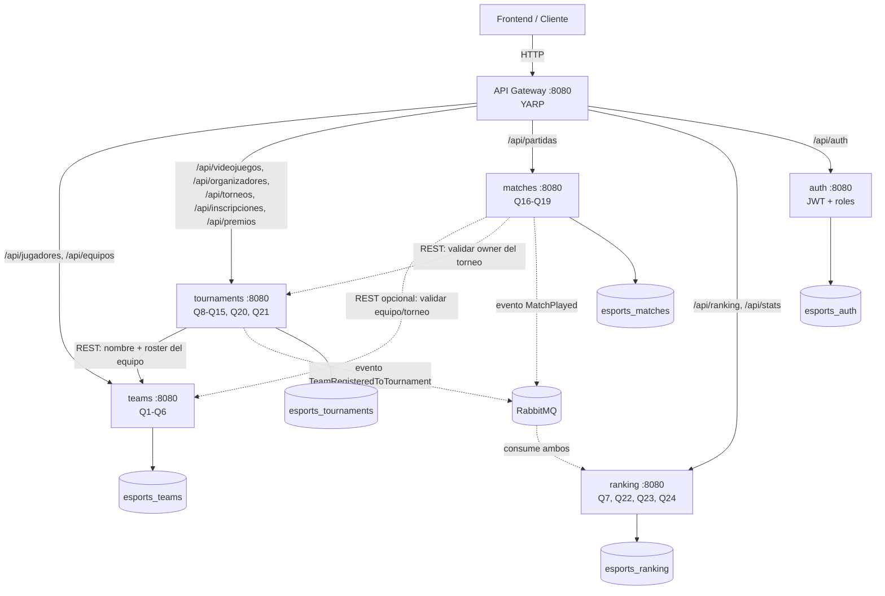

# 01 — Arquitectura

## Visión general

La plataforma es un sistema distribuido de microservicios. Cada servicio es dueño de su propio dominio y su propia base de datos (keyspace de Cassandra). Se comunican de dos formas: **REST síncrono** (cuando un servicio necesita un dato de otro en el momento) y **eventos asíncronos por RabbitMQ** (cuando un servicio necesita reaccionar a algo que pasó en otro, sin acoplarse). Un **API Gateway** (YARP) expone una sola URL pública.

El modelo Chebotko tiene 24 tablas (Q1–Q24) repartidas en 4 servicios de negocio según su dominio. Además existe un quinto servicio, `auth`, para identidad demo, JWT y autorización real por rol/ownership.

> Si tu visor no renderiza Mermaid: el frontend habla solo con el Gateway; el Gateway rutea a los 4 servicios de negocio y a `auth`; Tournaments le pide a Teams el nombre y roster del equipo por REST al inscribir; Matches le pide a Tournaments el torneo para verificar ownership; Tournaments y Matches publican eventos a RabbitMQ que Ranking consume para mantener rankings y estadísticas; cada servicio tiene su propio keyspace.

## Los servicios y sus fronteras

### teams (`esports_teams`) — Q1–Q6
Fuente de verdad de **jugadores y equipos**. Cubre búsqueda de jugadores por nickname (Q1) y por país (Q2), jugadores de un equipo filtrados por país (Q3), listado de equipos por fecha de creación (Q4), búsqueda de equipo por tag (Q5) e integrantes completos de un equipo (Q6). Cuando otro servicio necesita el nombre de un equipo o su roster, lo pide acá por REST.

### tournaments (`esports_tournaments`) — Q8–Q15, Q20, Q21
El servicio más grande. Aloja tres sub-dominios que giran alrededor del torneo:
- **Catálogos**: videojuegos por género (Q8) y lista de organizadores (Q10). Son entidades de referencia que solo existen en función de los torneos, por eso viven acá.
- **Torneos e inscripciones**: torneos por videojuego (Q9), por organizador (Q11), por fecha (Q12), búsqueda por código (Q15); equipos inscritos en un torneo (Q13) y torneos de un equipo (Q14). Las inscripciones son el corazón: al inscribir un equipo, este servicio escribe las tablas desnormalizadas y **publica un evento**.
- **Premios**: premios de un torneo (Q20) y premios recibidos por un equipo (Q21). Un premio pertenece al torneo, por eso vive acá.

### matches (`esports_matches`) — Q16–Q19
Dueño de las **partidas**. Partidas de un torneo en orden cronológico (Q16), historial de un equipo (Q17), partidas de un día (Q18) y enfrentamientos directos entre dos equipos (Q19). Una partida involucra dos equipos, así que al crearla escribe el historial para ambos y **publica un evento** que alimenta rankings y estadísticas.

También expone un endpoint público de showcase live (`GET /api/partidas/en-vivo/destacada`) para el home: simula T1 vs Gen.G durante 30 minutos con oro, kills y objetivos. Es estado efímero de transmisión; no escribe Cassandra ni publica `MatchPlayed`, para no contaminar rankings históricos.

### ranking (`esports_ranking`) — Q7, Q22, Q23, Q24
Servicio **puramente event-driven**. No tiene escritura pública: consume los eventos de Tournaments y Matches y mantiene read-models agregados — ranking global de equipos por torneos (Q7), por victorias (Q22), jugadores más activos (Q23) y estadísticas de un equipo por torneo (Q24). Expone solo lectura.

### auth (`esports_auth`) — identidad demo y JWT
Servicio dueño de usuarios demo y tokens JWT. Persiste `usuarios` en Cassandra con password PBKDF2 para el entorno académico. Emite claims `username`, `rol`, `organizador_id`, `equipo_id` y `nombre`. No decide reglas de negocio por sí solo: cada servicio dueño de la mutación valida token y ownership localmente con `Esports.Auth.Shared`.

## Comunicación

### REST síncrono (entre servicios)
Cuando un servicio necesita un dato de otro **al procesar un request**, lo pide por HTTP con `HttpClient` tipado (`AddHttpClient`, nunca `new HttpClient()`), con la URL inyectada por variable de entorno (`Services__Teams`, etc.).

Ejemplo concreto: al inscribir un equipo, `tournaments` necesita el `nombre_equipo` (para `equipos_por_torneo`) y la lista de `jugador_id` del roster (para armar el evento que alimenta Q23). Hace `GET http://teams:8080/api/equipos/{id}` y `GET http://teams:8080/api/equipos/{id}/integrantes`.

Otro ejemplo: al registrar una partida como organizador, `matches` necesita saber quién es dueño del torneo y qué equipos están inscritos. Hace `GET http://tournaments:8080/api/torneos/{id}` y `GET http://tournaments:8080/api/torneos/{id}/equipos` con `HttpClient` tipado; compara el `organizadorId` con el claim `organizador_id` y rechaza partidas entre equipos no inscritos.

### Autenticación y autorización
El gateway no centraliza reglas de permisos; solo reenvía el header `Authorization`. El servicio `auth` emite tokens, y `teams`, `tournaments` y `matches` validan esos tokens en sus mutaciones:

- `admin`: puede todo; lo usa el seeder y la suite de integración.
- `organizador`: puede operar únicamente torneos de su `organizador_id`. No administra videojuegos, porque son catálogo global.
- `capitan`: puede agregar jugadores/inscribir únicamente su `equipo_id`.
- `fan` o anónimo: solo lectura.

Las lecturas Q1–Q24 siguen públicas para que el frontend pueda funcionar como visitante.

### Eventos asíncronos (RabbitMQ + MassTransit v8)
Para **reaccionar a hechos** sin acoplar productor y consumidor. El productor no sabe quién consume.

- `tournaments` publica `TeamRegisteredToTournament` al inscribir → `ranking` incrementa el ranking de torneos del equipo (Q7) y de cada jugador (Q23).
- `matches` publica `MatchPlayed` al registrar una partida → `ranking` incrementa victorias del ganador (Q22) y actualiza estadísticas de ambos equipos en ese torneo (Q24).

Detalle completo en `docs/05-eventos.md`.

## Por qué una base por servicio (database-per-service)

Es el principio central de microservicios que la materia quiere ver: cada servicio es autónomo, se despliega y escala solo, y un problema en una base no tumba a los demás. El costo es que **no hay JOINs entre servicios** — por eso Cassandra (query-first, desnormalizado) encaja perfecto, y por eso aparecen datos duplicados (`nombre_equipo`, `nombre_torneo`) entre tablas.

## Desnormalización y dual-write

El modelo Chebotko duplica datos a propósito: una tabla por patrón de consulta. **Un solo hecho de negocio escribe varias tablas.** Reglas:

- **Dentro del mismo servicio**, las escrituras a varias tablas desnormalizadas van en un **`BATCH` de CQL** (logged batch), para que queden consistentes entre sí. Ejemplos:
  - teams, crear equipo → `equipos` + `equipos_por_fecha` + `equipos_por_tag`.
  - teams, agregar jugador a un equipo → `jugadores` + `jugadores_por_nickname` + `jugadores_por_pais` + `jugadores_por_equipo` + `integrantes_por_equipo`.
  - tournaments, crear torneo → `torneos` + `torneos_por_videojuego` + `torneos_por_organizador` + `torneos_por_fecha` + `torneo_por_codigo`.
  - tournaments, inscribir equipo → `equipos_por_torneo` + `torneos_por_equipo`.
  - tournaments, asignar premio → `premios_por_torneo` + `premios_por_equipo`.
  - matches, registrar partida → `partidas` + `partidas_por_torneo` + `partidas_por_equipo` (2 filas) + `partidas_por_fecha` + `partidas_por_rivales` (2 filas).
- **Entre servicios distintos** no hay BATCH posible (bases distintas). Ahí se usa REST (traer el dato al momento) o eventos (consistencia eventual).

## Flujos de ejemplo end-to-end

### Inscribir un equipo en un torneo
1. Frontend → `POST http://localhost:8080/api/torneos/{torneoId}/inscripciones` con `{ equipoId }`.
2. Gateway rutea a **tournaments**.
3. tournaments hace `GET http://teams:8080/api/equipos/{equipoId}` (nombre) y `GET .../integrantes` (roster).
4. tournaments escribe en un **`BATCH`**: `equipos_por_torneo` + `torneos_por_equipo`.
5. tournaments **publica** `TeamRegisteredToTournament(equipoId, torneoId, nombreEquipo, jugadorIds, fecha)`.
6. **ranking** consume el evento (asíncrono): `total_torneos += 1` del equipo (Q7) y de cada jugador del roster (Q23).
7. Respuesta `201 Created` (sin esperar al paso 6 — eso es eventual consistency).

### Registrar una partida
1. Frontend → `POST /api/partidas` con torneo, equipos y resultado/ganador.
2. Gateway rutea a **matches**.
3. matches escribe en un **`BATCH`** las 5 tablas (incluyendo 2 filas en `partidas_por_equipo` y 2 en `partidas_por_rivales`).
4. matches **publica** `MatchPlayed(partidaId, torneoId, equipoLocalId, equipoVisitanteId, equipoGanadorId, fecha)`.
5. **ranking** consume: `total_victorias += 1` del ganador (Q22); en `stats_equipo_por_torneo`, ganador `victorias+1, partidas_jugadas+1` y perdedor `derrotas+1, partidas_jugadas+1` (Q24).

Estos flujos tocan los tres patrones que la materia quiere demostrar: **gateway**, **REST entre servicios** y **event-driven con consistencia eventual**.

## Decisiones de arquitectura (mini-ADRs)

- **5 microservicios: 4 de negocio + auth.** Videojuegos, organizadores y premios siguen agrupados dentro de `tournaments` para no inflar servicios de dominio. `auth` se agregó como excepción deliberada porque los roles solo en frontend no protegían mutaciones ni ownership real.
- **Ranking & Stats juntos en un servicio event-driven.** Ambos son read-models derivados de eventos; comparten el mismo patrón (consumir → agregar con counters). Tenerlos juntos es coherente y es el mejor ejemplo de CQRS/event-driven para la defensa.
- **Un proyecto .NET por servicio, con carpetas internas** (Controllers/Domain/Repositories/Services/Events) en vez de Clean Architecture multi-proyecto. Razón: deadline corto.
- **Monorepo** (todo en un repo). Razón: 3 personas, un `git clone` + un `docker compose up`.
- **RF=1, single-node Cassandra.** Es entorno de desarrollo/demo en un laptop. En el informe NO afirmar que está "listo para producción".
- **Gateway con YARP** (no Ocelot). Mejor soportado en .NET 10, config por JSON.
